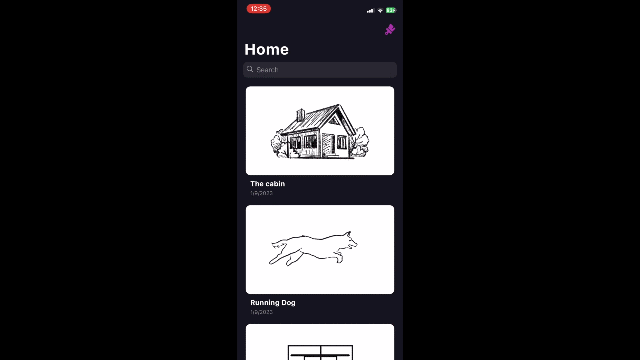

# ARSketch

## Overview
This app is designed to teach users sketching through an immersive Augmented Reality (AR) experience. Users can select a sketch and follow step-by-step instructions rendered in AR to improve their sketching skills. It is designed to be like a social media app where people can create and upload their sketches for people to trace and learn the process of sketching.


## Features
- Step-by-step sketching tutorials in AR.
- Sketch selection for a variety of skill levels.
- User-friendly Flutter app interface.

## How it works

The app makes a request to the server which respondes with an array of sketches with their phases. The app lists these sketches and listen for a tap event by the user. When tapped, a new page is opened with an array of phases corresponding to the selected sketch. The app takes a quick scan of the table, then after pressing start it uses AR technology to overlay the step-by-step phase of the sketch on the scanned surface.


## Demo Instructions
To run locally
1. Download the repository
2. Run the 

## Technologies Used
- Flutter: Frontend development.
- ARKit: Augmented Reality functionality.
- Django: Backend server for managing sketch data.

## Demo Instructions
Before attempting to run the app on your local machine, make sure these packages are installed.

1. Latest version of [Django](https://www.djangoproject.com/). Install by running:
```bash
pip3 install django
```
2. [Flutter](https://flutter.dev/) (atleast version 3.0)
3. [Python 3](https://www.python.org/)


To run the demo locally:

1. Download the repository.
2. Install required packages by running: 
```shell
pip install -r requirements.txt
```
3. Make migrations with django. Run:
```shell
python manage.py makemigrations
python manage.py migrate
```
4. Run the Django server on your local device by executing:
```shell
python manage.py runserver 0.0.0.0:8000
```
5. Make sure your machine and mobile phone are connected to the same network.
6. Under the constants file on `arsketch/lib/constants.dart`, change the `kDebugHost` variable to the IP address of your machine.
7. Run the Flutter app on your mobile device.

### Superuser - Username: admin2 & Password: admin2

## Target Audience
This app is tailored for individuals who are learning the basics of sketching and want a guided, interactive experience to enhance their skills.